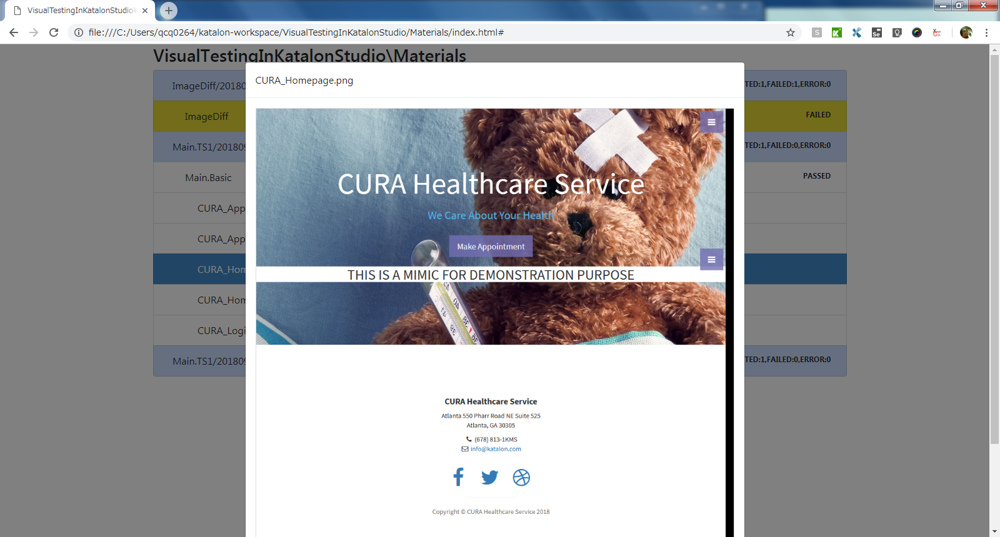
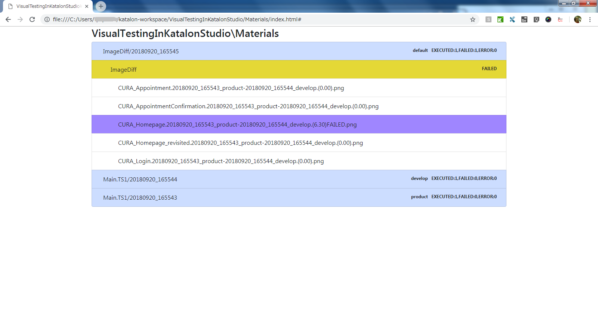
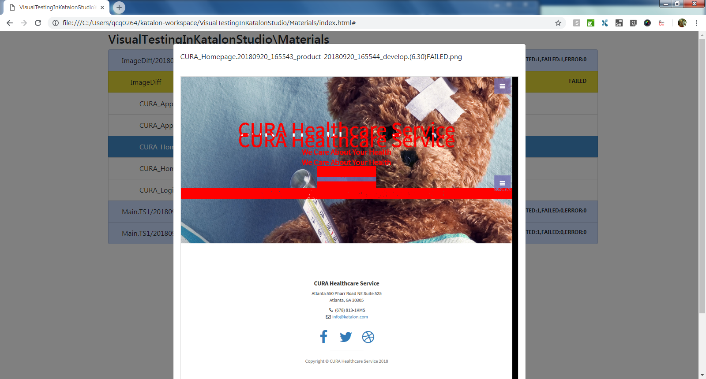
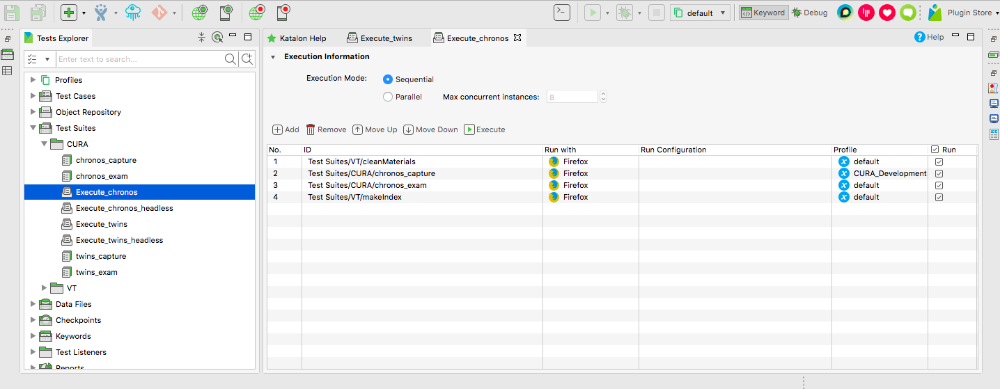
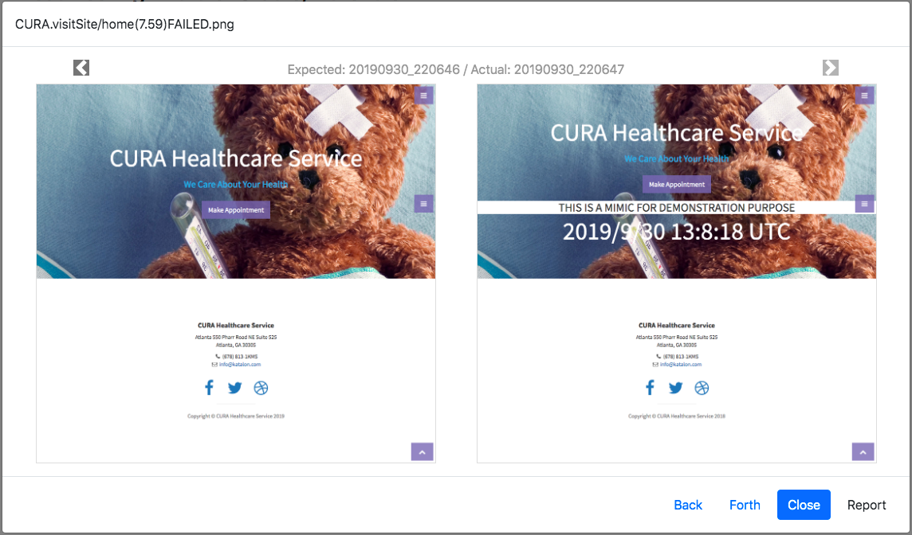
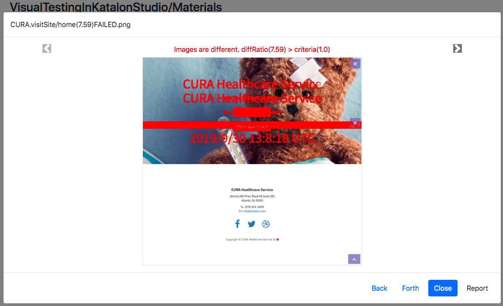

<!-- START doctoc generated TOC please keep comment here to allow auto update -->
<!-- DON'T EDIT THIS SECTION, INSTEAD RE-RUN doctoc TO UPDATE -->
**Table of Contents**  *generated with [DocToc](https://github.com/thlorenz/doctoc)*

- [Visual Testing in Katalon Studio](#visual-testing-in-katalon-studio)
  - [Overview of this project](#overview-of-this-project)
  - [Motivation](#motivation)
  - [Technical issues](#technical-issues)
  - [Solutions](#solutions)
  - [How to run the build-in examples](#how-to-run-the-build-in-examples)
    - [Execute_twins](#execute_twins)
      - [Input](#input)
      - [Output](#output)
    - [Execute_chronos](#execute_chronos)
      - [Input](#input-1)
      - [Output](#output-1)
  - [How to make your Katalon Studio project capable of *Visual Testing*](#how-to-make-your-katalon-studio-project-capable-of-visual-testing)
- [Revision history](#revision-history)
- [API doc](#api)

<!-- END doctoc generated TOC please keep comment here to allow auto update -->

Visual Testing in Katalon Studio
======

author: kazurayam

## Overview of this project

This is a [Katalon Studio](https://www.katalon.com/) project for demonstration purpose. You can clone this
out to your PC and run it with your Katalon Studio.

This project was initially developed using Katalon Studio 5.7.0, and has proved to work with the higher versions.

This project demonstrates how to perform screenshot-comparison testings in Katalon Studio.

## Motivation

- Often I have to look at the pages of a Web site. I may be a developer, a designer, a tester or just a fan of the site.
- I want to look at as many pages of the site as possible. Wide coverage matters.
- I want to compare 2 sets of screenshots of a pair of environments of my Application Under Test (AUT). I call this approach **Twins test**. E.g, comparing the Development environment to  the Production envirionement.
- Also I want to compare the current view of my AUT to the one chronologically previous. I call this approach  **Chronos test**. E.g, before and after any sort of changes of the Production system (application software upgrades, applying OS patches, changing of data in Database, network devices reconfiguration, etc).
- I want to take full-page screen shots of as many pages as possible.
- After taking screenshots, I want to check them and find out if there are any visual  differences between the two.
- If not significant difference found, OK, I am relieved and can go home. If any significant visual difference found, whatever the cause can be, I would fix it immediately.

If my AUT has 100 pages and if I do it manually, it would take me more than 1 hour to go through a Twins test. It's too tiring, too boring. I don't like doing such slavery labour! Therefore I would add the final term:

- I want to automate it.

And let be add some more terms:

- I would not require the tool to be equipped with full fledged debugging functionalities. All I want is to be notified of indication of possible faults.
- Preferably the tool should be free of charge.

## Technical issues

Preliminary study revealed 2 technical problems.

1. I wanted to make tens or hundreds of screenshot files on local disk of my PC and reuse them. One scripts writes a screenshot in that path, another scripts reads the file form that path. Both scripts should share the common path format and respect it. So I had to define how the file paths format should be and develop a library in Groovy or Java.
2. Katalon Studio has a built-in Keyword to take screenshot:  [org.openqa.selenium.TakesScreenshot#getScreenshotAs(output)](https://seleniumhq.github.io/selenium/docs/api/java/org/openqa/selenium/TakesScreenshot.html). But the image taken by this is not full-page size. I needed alternative.

## Solutions

This project demonstrates how to take multiple sets of web page screen shots and store them into a well-structured file system tree. This demo project uses another GitHub repository:
- [`Materials`](https://github.com/kazurayam/Materials)

As for the full-page screenshot problem, I found that the library:

- [`aShot`](https://github.com/yandex-qatools/ashot)

This library solves the problem like a charm. I wrote a report how I utilized aShot in Katalon Studio:[Entire page screenshot by aShot in Katalon Studio](https://github.com/kazurayam/EntirePageScreenshotByAShotInKatalonStudio)

I have integrated those external resources to build a tool set for *Visual Testing* in Katalon Studio.

## How to run the build-in examples

1. git clone [this project](https://github.com/kazurayam/VisualTestingInKatalonStudio).
1. start your Katalon Studio, open this project
1. in `Tests Explorer` pane, click `Test Suites/CURA`
1. The example assumes you have Firefox browser installed. In not, please install Firefox. Otherwise you can change the definition of Test Suite Collections to use Google Chrome browser.

### Execute_twins

Now you open and run a Test Suite Collection named "`Test Suites/CURA/Execute_twins`".

#### Input

The Test Suite Collection `Executes_twins` takes screenshots of **a pair of URLs**:
1. http://demoaut.katalon.com/  --- can be regarded as *Production environment*
2. http://demoaut-mimic.kazurayam.com/ --- can be regarded as *Development environment*

For example, the test may capture screenshots as follows.

1. Production page: `<projectDir>/Materials/Main.TS1/20180920_165543/Main.Basic/CURA_Homepage.png`  
2. Development page: <projectDir>/Materials/Main.TS1/20180920_165544/Main.Basic/CURA_Homepage.png  

#### Output

This test generates a report at `<projectDir>/Materials/index.html` where you will find screenshot-comparison result.

You can see an example output in action uploaded public : http://vtprojects.kazurayam.com/VisualTestingInKatalonStudio/Materials/index.html

Please find the html using Windows Explorer or Mac Finder. Unfortunately Katalon Studio GUI does not let us see the Materials/index.html. Open the html with your favorite web browser. You should bookmark it.

The Materials/index.html would show a list of source images plus the images as comparison result.

If you click the line with purple background color, you will see a ImageDiff with a lot of red-portion. The red portion shows the differences between the two source images.

File path: `<projectDir>/Materials/ImageDiff/yyyyMMdd_hhmmss/ImageDiff/CURA_Homepage.yyyyMMdd_hhmmss_product-yyyyMMdd_hhmmss_develop.(6.30)FAILED.png`

The area painted red indicates that the pair of screenshots of 2 hosts are different. This tool does not tell you why. It just lets you know of the difference. You, as a developer, should be able to investigate the reason of the difference.

### Execute_chronos

The example provides one more interesting script named `Test Suites/CURA/Execute_chronos`.

#### Input

`Execute_chronos` takes screenshots of a single URL:
- http://demoaut-mimic.kazurayam.com/

and compares it **to another set of screenshots of the same URL taken previously**. It can compare the current set of screenshot to another set proviously taken. You can choose one of the following:

1. the last previous set of screenshots (default)
2. the one taken before 10 minutes ago
3. the one taken before 30 minutes ago
4. the one taken before 1 hour ago
5. the one taken before 2 hours ago
6. the one taken before 6AM today
7. the one taken before 9AM today
8. the one taken before 12AM today
9. the one taken before 15PM today
10. the one taken before 18PM today
11. the one taken before 21PM today
12. the one taken before 18PM last evening

you can see how these STRATEGIES are implemented in [Test Cases/VT/restorePreviousTSuiteResult](https://github.com/kazurayam/VisualTestingInKatalonStudio/blob/develop/Scripts/VT/restorePreviousTSuiteResult/Script1550220558541.groovy)

#### Output

The output of `Execute_chronos` is just similar to the one created by `Execute_twins`. Please find `<projectDir>/Materials/index.html`.

As of v1.12.0, the Modal dialog presents 2 pane in a carousel format. The first pane shows Expected image on the left, Actual image on the right.

And another pane shows the Diff image.

You can switch between the 2 panes by a single mouse click on . This format makes it easy to locate and see the visual differences in the Expected-Actual images.

## How to make your Katalon Studio project capable of *Visual Testing*

Are you interested in this? Do you want to do similar screenshot-comparison testing against your own Application Under Test in your own Katalon Studio project?

The following page describes how to import `Test Suites/CURA/Execute_twins` and `Test Suites/CURA/Execute_chrones` into your own Katalon Studio project:

- [visualtestinginks --- a Gradle Plugin](https://github.com/kazurayam/visualtestinginks-gradle-plugin)

You can make a copy of "CURA" resources and rename them to your own AUT symbol. You want to modify the code as you want to accomplish your own Visual Testing. The following page describe how to getting started with customization.

- [customVisualTesting](docs/customVisualTesting.md)

## External Dependencies

- [ashot](https://mvnrepository.com/artifact/ru.yandex.qatools.ashot/ashot/1.5.4)
- [commons-math3](https://mvnrepository.com/artifact/org.apache.commons/commons-math3/3.6.1)
- [junit4ks](https://github.com/kazurayam/junit4ks)
- [ksbackyard](https://github.com/kazurayam/ksbackyard)
- [Materials](https://github.com/kazurayam/Materials)
- [thumbnailator](https://mvnrepository.com/artifact/net.coobird/thumbnailator/0.4.8)

## other notes

[Miscellaneous](docs/miscSpecifications.md)

# Revision history

see [Revision History](docs/revision_history.md)

# API doc

see [Groovydoc](https://kazurayam.github.io/VisualTestingInKatalonStudio/api/)
