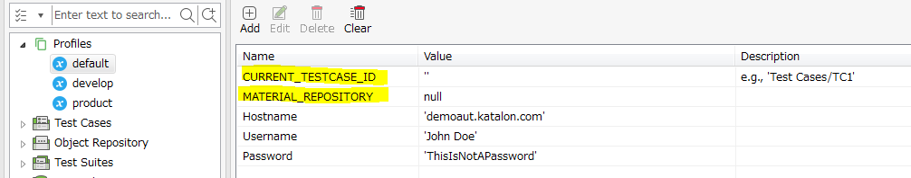
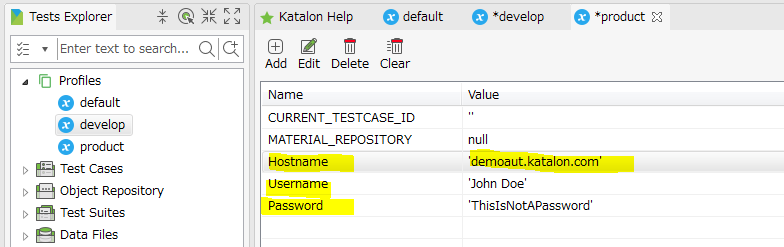

Step by step instruction how to create your own visual testing project
===========

In this note, I will describe how you create a new Katalon Studio project and set it up to carry out *Visual Testing* as I did.

I assume that you want your new project:
1. to take screenshots of 2 environments of your AUT (*Application Under Test*) : *Development* and *Production*
2. to compare images to find any significant visual differences
3. to make a HTML view of generated image files
4. to make the HTML view shows the summary of test results (PASS/FAILED)

I will use a term '*the demo project*' for short for the  [VisualTestingInKatalonStudio](https://github.com/kazurayam/VisualTestingInKatalonStudio) project.

## (1) create a new Katalon Studio project

Do it as usual.

## (2) resolve external dependencies

You need to include 2 external jar files into your new project.

1. `aShot` : WebDriver Screenshot utility. Its jar is public at the [MavenCentral repository](https://mvnrepository.com/artifact/ru.yandex.qatools.ashot/ashot/1.5.4). Also you can reuse the `ashot-1.5.4.jar` contained in the demo project's [`Drivers`](../Drivers) directory.

2. `Materials` : Utility that manages the `<project dir>/Materials` directory where you can store any files created by test cases in a well structured path format. Another project  [UsingMaterialsInKatalonStudio](https://github.com/kazurayam/UsingMaterialsInKatalonStudio) describes how to use the `Materials` library in detail. The Materials-0.22.0.jar file is public at the [releases](https://github.com/kazurayam/Materials/releases) page. Also you can reuse the jar file contained in the demo project's [`Drivers`](../Drivers) directory.

Please refer to the Katalon Documentation [*How to import external libarary into your automation project*](https://docs.katalon.com/katalon-studio/tutorials/import_java_library.html) for Katalon GUI operation.

## (3) create GlobalVariables for the Materials library to run

The Materials library requires 2 GlobalVariables defined.

1. `GlobalVariable.MATERIAL_REPOSITORY` : its type must be Null
2. `GlobalVariable.CURRENT_TESTCASE_ID` : its type must be String

You need to define them in the Execution Profiles in your project. Following screen shot shows 2 variables defined in the *default* Profile.

## (4) create Profiles which stands for environments of AUT

The demo project has 2 more profiles named `develop` and `product`. The profile `develop` stands for the Development Environment for the AUT (*Application Under Test*). The profile `product` stands for the Production Environment for the AUT.

Each profiles contains a set of GlobalVariables: `Hostname`, `Username`, `Password` as parameters which are environment-dependent. Which parameters to define here? it depends on the AUT you are going to work on. Possibly you need `Hostname` but may not need `Username` and `Password` for your AUT.

Please note the `GlobalVariable.Hostname` are environment-specific. In other words, URL differentiates 2  environments.

Profle > `develop`

Profile > `product`

The Materials libare does require
`GlobalVariable.MATERIAL_REPOSITORY` and `GlobalVariable.CURRENT_TESTCASE_ID` to be defined in the `develop` and `product` profiles as well.

The Materials library does NOT require `Hostname`, `Username`, `Password`.

## (5) create a Test Listener

You need to create a Test Listener named `Test Listeners/TL` in your project. All `TL` does is to set appropriate values to `GlobalVariable.MATERIAL_REPOSITORY` and `GlobalVariable.CURRENT_TESTCASE_ID`.

You can copy the code of the [`Test Listners/TL`](../Test%20Listeners/TL.groovy) into you test listener `TL`. You need not to modify it at all.

Or if you want you make your own test listener, you can do so of course. Please merge the codes of [`Test Listners/TL`](../Test%20Listeners/TL.groovy) into yours carefully.

## (6) make a Test Case and Test Suite to take screen shots of your AUT

----

create a new Katalon Studio for you
import the jar file of aShot into the project. see the Katalon document How to import external library into your automation project . The jar of aShot is here. Or you can reuse the ashot-x.x.x.jar bundled in the demo project's ./Drivers folder.
import the jar file of Materials. The jar file is donwloadable at Releases page. Or you can reuse the Materials-x.x.x.jar bundled in the demo project's ./Drivers folder.
create 2 custom keywords: com.kazurayam.ksbackyard.Assert and com.kazurayam.ksbackyard.ScreenshotDriver. Copy the Groovy source from the demo project into your replication. You do not have to modify the source of 2 keywords. Keywords
create Test Listeners/TL. Copy the Groovy source from the demo project into your replication. You do not have to modify the source.
modify the default Profile and add 2 GlobalVariables: MATERIAL_REPOSITORY of type Null, CURRENT_TESTCASE_ID of type String. No inital value required. The Test Listener TL will resolve appropriate values runtime.GlobalVariables_default
Finally you need to develop test cases and test suites. Create a mimic of Test Cases/verify-slideshow-example and modify it as you would like. I have written as much comments in the Groovy source. Read them and find how to customize to meet your requirements.
