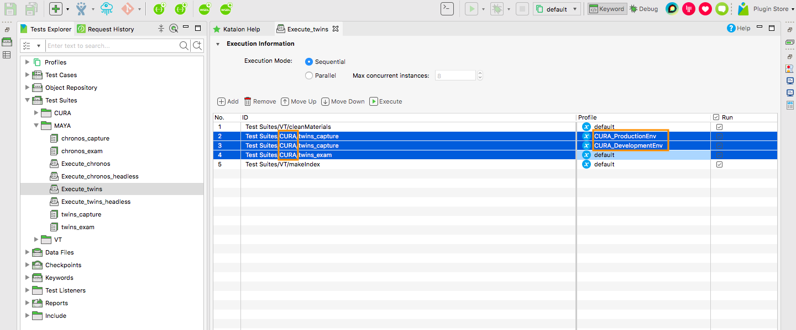
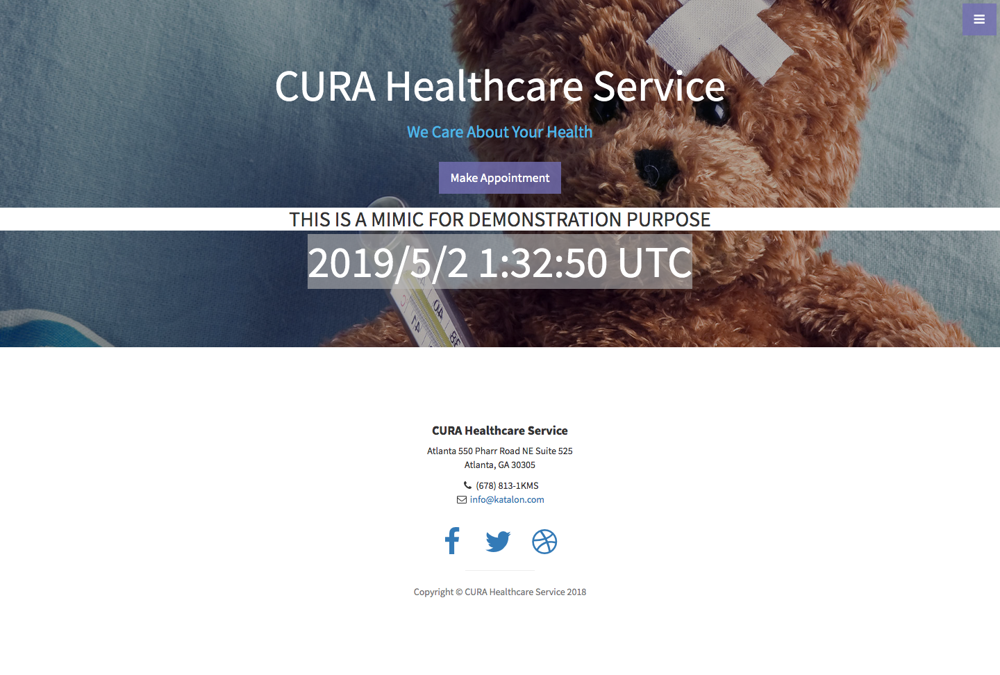

<!-- START doctoc generated TOC please keep comment here to allow auto update -->
<!-- DON'T EDIT THIS SECTION, INSTEAD RE-RUN doctoc TO UPDATE -->
**Table of Contents**  *generated with [DocToc](https://github.com/thlorenz/doctoc)*

- [Getting started with custom Visual Testing](#getting-started-with-custom-visual-testing)
  - [Define a symbol of your target application](#define-a-symbol-of-your-target-application)
  - [Copy CURA resources to make the base of MAYA](#copy-cura-resources-to-make-the-base-of-maya)
  - [Modify codes to target your AUT](#modify-codes-to-target-your-aut)
  - [Developing "Test Cases/MAYA/visitSite"](#developing-test-casesmayavisitsite)
    - [How to take screenshot and save into file](#how-to-take-screenshot-and-save-into-file)
    - [Path-resolver methods provided by MaterialRepository](#path-resolver-methods-provided-by-materialrepository)
    - [Object Repository](#object-repository)
  - [Developing "Test Suites/MAYA/Execute_twins"](#developing-test-suitesmayaexecute_twins)
  - [Developing "Test Suites/MAYA/Execute_chronos"](#developing-test-suitesmayaexecute_chronos)
    - [Which of previous set of screenshot to compare the current against?](#which-of-previous-set-of-screenshot-to-compare-the-current-against)
    - [Criteria of examining image differences](#criteria-of-examining-image-differences)

<!-- END doctoc generated TOC please keep comment here to allow auto update -->

Getting started with custom Visual Testing
===========================================

author: kazurayam

In this article I will explain how develop a screenshot-comparison testing
against an Application-Under-Test you choose.

Here I assume you have read the following articles.
1. [README of Gradle Plugin com.github.kazurayam.visualtestinginks](https://github.com/kazurayam/visualtestinginks-gradle-plugin)
2. [User Guide of visualtestinginks](https://github.com/kazurayam/visualtestinginks-gradle-plugin/blob/master/docs/userguide.md)

and you have created a new Katalon Studio project. Of course, you can name it as you want, but here I assume the project is called `TheProject`.

I assume that you have imported `vt-components-X.X.X.zip` and `vt-example-X.X.X.zip` into `ThePoject` using `com.github.kazurayam.visualtestinginks`

## Define a symbol of your target application

When you start developing custom Visual Testing in Katalon Studio, the 1st thing you should do is to define a short name which identifies
your target AUT. The example uses `CURA`. So what would you call your test? Any name you like. I would recommend the symbol to be short to make the codes readable.

Just in the following description, let me assume that you selected a symbol `MAYA`.

## Copy CURA resources to make the base of MAYA

As [User Guide of visualtestinginks](https://github.com/kazurayam/visualtestinginks-gradle-plugin/blob/master/docs/userguide.md) described, you should have got a set of Katalon Studio resources named `CURA`.
Now you want to copy them and rename them with new name `MAYA`.
```
.
├── Object Repository
│   └── MAYA
│       ├── Page_Appointment
│       │   ├── button_Book Appointment.rs
│       │   ├── h2_Make Appointment.rs
│       │   ├── input_hospital_readmission.rs
│       │   ├── input_programs.rs
│       │   ├── input_visit_date.rs
│       │   ├── select_Tokyo CURA Healthcare C.rs
│       │   └── textarea_comment.rs
│       ├── Page_AppointmentConfirmation
│       │   ├── a_Go to Homepage.rs
│       │   ├── p_comment.rs
│       │   ├── p_facility.rs
│       │   ├── p_hospital_readmission.rs
│       │   ├── p_program.rs
│       │   └── p_visit_date.rs
│       ├── Page_Homepage
│       │   └── a_Make Appointment.rs
│       └── Page_Login
│           ├── button_Login.rs
│           ├── input_password.rs
│           └── input_username.rs
├── Profiles
│   ├── MAYA_DevelopmentEnv.glbl
│   ├── MAYA_ProductionEnv.glbl
|
├── Scripts
│   ├── MAYA
│       ├── ImageDiff_chronos
│       ├── ImageDiff_twins
│       ├── Login
│       ├── restorePrevisousScreenshots
│       └── visitSite
├── Test Cases
│   ├── MAYA
│       ├── ImageDiff_chronos.tc
│       ├── ImageDiff_twins.tc
│       ├── Login.tc
│       ├── restorePrevisousScreenshots.tc
│       └── visitSite.tc
├── Test Suites
│   ├── MAYA
│       ├── Execute_chronos.ts
│       ├── Execute_chronos_headless.ts
│       ├── Execute_twins.ts
│       ├── Execute_twins_headless.ts
│       ├── chronos_capture.groovy
│       ├── chronos_capture.ts
│       ├── chronos_exam.groovy
│       ├── chronos_exam.ts
│       ├── twins_capture.groovy
│       ├── twins_capture.ts
│       ├── twins_exam.groovy
│       └── twins_exam.ts
├── vt-run-MAYA-chronos.bat
├── vt-run-MAYA-chronos.sh
├── vt-run-MAYA-twins.bat
└── vt-run-MAYA-twins.sh
```

## Modify codes to target your AUT

1. In the `Test Suites/MAYA` folder, there are few resources that need to be changed. For example `Test Suites/MAPA/Execute_twins` still has the definition refering to `CURA` components: 
Please edit the definition so that refer to `CURA` -> `MAYA` resources. The following resources needs to be edited similarly.
  - `Test Suites/MAYA/chronos_capture`
  - `Test Suites/MAYA/chronos_exam`
  - `Test Suites/MAYA/Execute_chronos`
  - `Test Suites/MAYA/Execute_chronos_headless`
  - `Test Suites/MAYA/Execute_twins`
  - `Test Suites/MAYA/Execute_twins_headless`
  - `Test Suites/MAYA/twins_capture`
  - `Test Suites/MAYA/twins_exam`
2. In the `Test Cases/MAYA` folder, there are some resources that need to be corrected: `CURA` -> `MAYA`.
  - `Test Cases/MAYA/ImageDiff_chronos`
  ```
  String TESTSUITE_ID = 'CURA/chronos_capture' // should be changed to 'MAYA_chronos_capture'
  ```
  - `Test Cases/MAYA/ImageDiff_twins`
  ```
  String TESTSUITE_ID = 'CURA/twins_capture' // -> 'MAYA/twins_capture'
  ```
3. The core part of cutomization is `Test Cases/MAYA/visiteSite`. This script visits
you AUT and take screenshots. You should rewrite this script completely. and 99% of
your customization should be on this script.
4. You would want to renew the `Object Repository` as you want. Just do it.

## Developing "Test Cases/MAYA/visitSite"

You would want to rewrite The `Test Casees/MAYA/visitSite` completely to target your AUT. Just do it as orginaly Katalon Studio programming. All you need to know is how to save screenshots into files.

### How to take screenshot and save into file

The [`Test Cases/CURA/visitSite`](../Scripts/CURA/visitSite/Script1554796633484.groovy) has following lines. This is the core part of taking screenshot and saving it into files.

```
import com.kazurayam.materials.MaterialRepository
import com.kazurayam.visualtesting.ManagedGlobalVariable as MGV

...

MaterialRepository mr = (MaterialRepository)GlobalVariable[MGV.MATERIAL_REPOSITORY.getName()]

...

Path png3 = mr.resolveScreenshotPathByURLPathComponents(
					GlobalVariable[MGV.CURRENT_TESTCASE_ID.getName()],
					new URL(WebUI.getUrl()),
					0)
CustomKeywords.'com.kazurayam.ksbackyard.ScreenshotDriver.takeEntirePage'(driver, png3.toFile(), 500)

```

In the above code, the`MaterialRepository mr = ...` portion would look mysterious. In fact, here is hidden a magic. But you can read the source code at `Test Listeners/VTListener` and `Keywords/com/kazurayam/visualtesting/VisualTestingListenerImpl`. If you want to dig into them, please do.

Once executed, this script creates a file at
- `<projectDir>/Materials/CURA.twins_capture/yyyyMMdd_hhmmss/CURA.visitSite/appointment.php%23summary.png`

As you can see, `mr.resolveScreenshotPathByURLPathComoponents()` call determines the file path. How is it done?

`<projectDir>/Materials/` portion is fixed.

The directory name `CURA.twins_capture` is derived from the Test Suite name `CURA/twins_capture`.

The directory name `yyyyMMdd_hhmmss` is derived from the timestamp when the Test Suite was executed.

The directory name `CURA.visitSite` is derived from the Test Case name `CURA/visitSite`.

Finally the file name `appointment.php%23summary.png` is derived from the page URL `https://katalon-demo-cura.herokuapp.com/#appointment`.

### Path-resolver methods provided by MaterialRepository

The API doc of the `Materials` library is available here: https://kazurayam.github.io/Materials/api/com/kazurayam/materials/MaterialRepository.html

Please check the sample codes of the following `resolveXXX` methods of `com.kazurayam.material.MaterialRepository` interface:

1. [resolveScreenshotPathByURLPathComponents](https://kazurayam.github.io/Materials/api/com/kazurayam/materials/MaterialRepository.html#resolveScreenshotPathByURLPathComponents%28java.lang.String,%20java.net.URL,%20int,%20java.lang.String%29) --- primary candidate to use
2. [resolveScreeshotPath](https://kazurayam.github.io/Materials/api/com/kazurayam/materials/MaterialRepository.html#resolveScreenshotPath%28java.lang.String,%20java.net.URL%29)
3. [resolveMaterialPath](https://kazurayam.github.io/Materials/api/com/kazurayam/materials/MaterialRepository.html#resolveMaterialPath%28java.lang.String,%20java.lang.String,%20java.lang.String%29) --- if you prefer names independent from URL string

### Object Repository

`Object Repository/MAYA/*` --- you would not need files copied form "CURA" any longer once you created your own `Test Cases/MAYA/visitSite`. You can delete them. You can create new Test Objects. Completely up to you.

## Developing "Test Suites/MAYA/Execute_twins"

In [`Test Cases/CURA/ImageDiff_twins`](../Scripts/CURA/ImageDiff_twins/Script1554796606098.groovy), you find this line:
```
double criteriaPercentage = 1.0

CustomKeywords.'com.kazurayam.visualtesting.ImageDiffer.runTwins'(TESTSUITE_ID, criteriaPercentage)
```

The *criteriaPercentage* is a number larger than or equal to 0.0, smaller than or equal to 100.0.
If a difference image of 2 PNG files has difference percentage larger than the criteriaPercentage,
then the `Test Cases/CURA/ImageDiff_twins` fails. The `Materials/index.html` will show the failure with
purple-colored background.

You can tune the value of *criteriaPercentage* in your `Test Cases/MAYA/ImageDiff_twins` as you want. You may set it to be 0.01, 1.0, 5.0 or 30.0. It is the only factor you can tune for test sensitivity.

If you set a smaller number to the *criteriaPercentage*, then the test becomes more sensitive and tends to fail more often. In other words, it is likely that the test becomes more false-negative. If you set a larger number, then test becomes tolerant for image-difference and test to fail less --- it becomes more false-positive.

What value is suitable for your AUT? --- Just make many experiments and get your own idea.

## Developing "Test Suites/MAYA/Execute_chronos"

### Which of previous set of screenshot to compare the current against?

Please have a look at [`Test Cases/CURA/restorePreviousScreenshots`](Scripts/CURA/restorePrevisousScreenshots/Script1554799055106.groovy).
```
WebUI.callTestCase(findTestCase("Test Cases/VT/restorePreviousTSuiteResult"), ["STRATEGY":"last"])
//WebUI.callTestCase(findTestCase("Test Cases/VT/restorePreviousTSuiteResult"), ["STRATEGY":"1hourAgo"])
//WebUI.callTestCase(findTestCase("Test Cases/VT/restorePreviousTSuiteResult"), ["STRATEGY":"18pmLastEvening"])
```

What this 1 line does?

The `Test Cases/VT/restorePreviousTSuiteResult` script selects a set of screenshots previously took. The current screenshots will be compared against them.

The scripts accepts various "STRATEGY", which you can see at [`Test Cases/VT/restorePreviousTSuiteResult`](Scripts/VT/restorePreviousTSuiteResult/Script1550220558541.groovy).

1. `last`: restore the last shot previous to the current
2. `10minutesAgo`: restore the shot of 1 hour ago or older
3. `30minutesAgo`: restore the shot of 1 hour ago or older
4. `1hourAgo`: restore the shot of 1 hour ago or older
5. `2hoursAgo`: restore the shot of 2 hours ago or older
6. `6amToday`: restore the shot taken before 6AM today
7. `9amToday`: restore the shot taken before 6AM today
8. `12amToday`: restore the shot taken before 6AM today
9. `15pmToday`: restore the shot taken before 6AM today
10. `18pmToday`: restore the shot taken before 6AM today
11. `21pmToday`: restore the shot taken before 6AM today
12. `18pmLastEvening`: restore the shot of last evening 18:00 or older

### Criteria of examining image differences

The Test Suite Collection `Test Suites/CURA/Execute_chronos` targets to the URL http://demoaut-mimic.kazurayam.com/ .



Please visit this URL yourself, and try pushing Reflesh button several times.
You will notice 2 points.
1. A timestamp like `2019/5/2 1:32:50 UTC` is displayed. The timestamp changes everytime you refleshed the screen. Timestamp makes the current screenshot slightly different form the previous one.
2. The background image (a photo of Teddy Bear) sometimes get dark. I inserted a JavaScript to toggle the brightness of the image. I did it intensionally to make this URL suitable for demonstrating screenshot-comparison testing.

Now, have a look at [`Test Cases/CURA/ImageDiff_chorons`](../Scripts/CURA/ImageDiff_chronos/Script1554799216780.groovy). In that code, you find this line:

```
import com.kazurayam.visualtesting.ImageCollectionDifferDriver.ChronosOptions

ChronosOptions options = new ChronosOptions.Builder().
							filterDataLessThan(0.0).
							shiftCriteriaPercentageBy(0.0).
							build()

CustomKeywords.'com.kazurayam.visualtesting.ImageDiffer.runChronos'(TESTSUITE_ID, options)
```

The [`com.kazurayam.visualtesting.ImageCollectionDifferDriver.ChronosOptions`](https://github.com/kazurayam/VisualTestingInKatalonStudio/blob/master/Keywords/com/kazurayam/ksbackyard/ImageCollectionDiffer.groovy) object can contain 2 options: `filterDataLessThan` and `shiftCriteriaPercentageBy`. These options control the behavior of *com.kazurayam.visualtesting.ImageDiffer.runChronos* call.

What is the meaning of these options? A concrete example would explain best. Let me present a case.

I executed `Test Suites/CURA/Execute_chronos` 10 times. A JSON file `Materials/CURA.chronos_exam/20190502_100304/CURA.ImageDiff_chronos/image-delta-stats.json` was created. In there you can find some statistics about the image-deltas of previous screenshots.

```
                {
                    "path": "CURA.visitSite/home.png",
                    "degree": 10,
                    "sum": 89.47,
                    "mean": 8.947,
                    "variance": 3.494861290885145,
                    "standardDeviation": 1.8694548111374998,
                    "tDistribution": 1.8331129326620088,
                    "confidenceInterval": {
                        "lowerBound": 7.863312177615391,
                        "uppderBound": 10.030687822384607,
                        "confidenceLevel": 0.95
                    },
                    "criteriaPercentage": 10.04,
                    "data": [
                        0.23,
                        0.18,
                        0.28,
                        0.26,
                        0.19,
                        42.88,
                        42.9,
                        1.21,
                        1.2,
                        0.14
                    ],
                    "imageDeltaList": [
                        {
                            "a": "20190502_114009",
                            "b": "20190502_113806",
                            "d": 0.23,
                            "cached": false
                        },
                        {
                            "a": "20190502_113806",
                            "b": "20190502_110956",
                            "d": 0.18,
                            "cached": true
                        },
                        {
                            "a": "20190502_110956",
                            "b": "20190502_104112",
                            "d": 0.28,
                            "cached": true
                        },
                        {
                            "a": "20190502_104112",
                            "b": "20190502_103800",
                            "d": 0.26,
                            "cached": true
                        },
                        {
                            "a": "20190502_103800",
                            "b": "20190502_103545",
                            "d": 0.19,
                            "cached": true
                        },
                        {
                            "a": "20190502_103545",
                            "b": "20190502_103149",
                            "d": 42.88,
                            "cached": true
                        },
                        {
                            "a": "20190502_103149",
                            "b": "20190502_102845",
                            "d": 42.90,
                            "cached": true
                        },
                        {
                            "a": "20190502_102845",
                            "b": "20190502_102421",
                            "d": 1.21,
                            "cached": true
                        },
                        {
                            "a": "20190502_102421",
                            "b": "20190502_102153",
                            "d": 1.20,
                            "cached": true
                        },
                        {
                            "a": "20190502_102153",
                            "b": "20190502_101957",
                            "d": 0.14,
                            "cached": true
                        }
                    ]
                },
```

`data: [0.23, 0.18, 0.28, 0.26, 0.19, 42.88, 42.9, 1.21, 1.2, 0.14]` --- these are the percentage of image-difference of the image `CURA.visiteSite/home.png`. The timestamp always changes; it causes small differences. The background-image sometimes goes dark; it causes significant image difference around 42% to 43%.

The data is a typical *bimodal distribution*. I should screen the data to make the data useful.

I am interested in the significant image difference only, and do not want to be disturbed by the small differences caused by timestamp. I can use `filterDataLessThan(2.0)` option to ignore differences less than 2.0%.

Now let me try:
```
{
                    "path": "CURA.visitSite/home.png",
                    "degree": 2,
                    "sum": 86.33,
                    "mean": 43.165,
                    "variance": 0.5244044240850744,
                    "standardDeviation": 0.7241577342575818,
                    "tDistribution": 6.313751514675079,
                    "confidenceInterval": {
                        "lowerBound": 39.9320003221718,
                        "uppderBound": 46.397999677828196,
                        "confidenceLevel": 0.95
                    },
                    "criteriaPercentage": 48.40,
                    "data": [
                        43.44,
                        42.89
                    ],
                    "imageDeltaList": [
                        {
                            "a": "20190502_121454",
                            "b": "20190502_121216",
                            "d": 0.17,
                            "cached": false
                        },
                        {
                            "a": "20190502_121216",
                            "b": "20190502_120951",
                            "d": 0.17,
                            "cached": true
                        },
                        {
                            "a": "20190502_120951",
                            "b": "20190502_120623",
                            "d": 1.18,
                            "cached": true
                        },
                        {
                            "a": "20190502_120623",
                            "b": "20190502_120352",
                            "d": 43.44,
                            "cached": true
                        },
                        {
                            "a": "20190502_120352",
                            "b": "20190502_120113",
                            "d": 42.89,
                            "cached": true
                        },
                        {
                            "a": "20190502_120113",
                            "b": "20190502_115905",
                            "d": 1.24,
                            "cached": true
                        },
                        {
                            "a": "20190502_115905",
                            "b": "20190502_115616",
                            "d": 1.23,
                            "cached": true
                        },
                        {
                            "a": "20190502_115616",
                            "b": "20190502_114009",
                            "d": 1.22,
                            "cached": true
                        },
                        {
                            "a": "20190502_114009",
                            "b": "20190502_113806",
                            "d": 0.23,
                            "cached": true
                        },
                        {
                            "a": "20190502_113806",
                            "b": "20190502_110956",
                            "d": 0.18,
                            "cached": true
                        }
                    ]
                },
```

Now I got `data: [43.44, 42.89]` --- here small diffs are ignored.

The `com.kazurayam.visualtesting.ImageDiffer.runChronos` applies Interval Estimation to deduce `criteriaPercentage` based on the data. In the above example, it was `"criteriaPercentage": 48.40`. If the image difference of the current screenshot from the last one exceed 48.40, then the test should fail. Otherwise succeeds.

What use  of `shiftCriteriaPercentageBy(10.0)` option? --- the criteriaPercentage will be = the value calculated on the data using Interval Estimation method + intentional shift of 10.0.

ShiftCriteriaPercentageBy is useful to intensionally tune how much the test should be sensitive about image-diffs.
